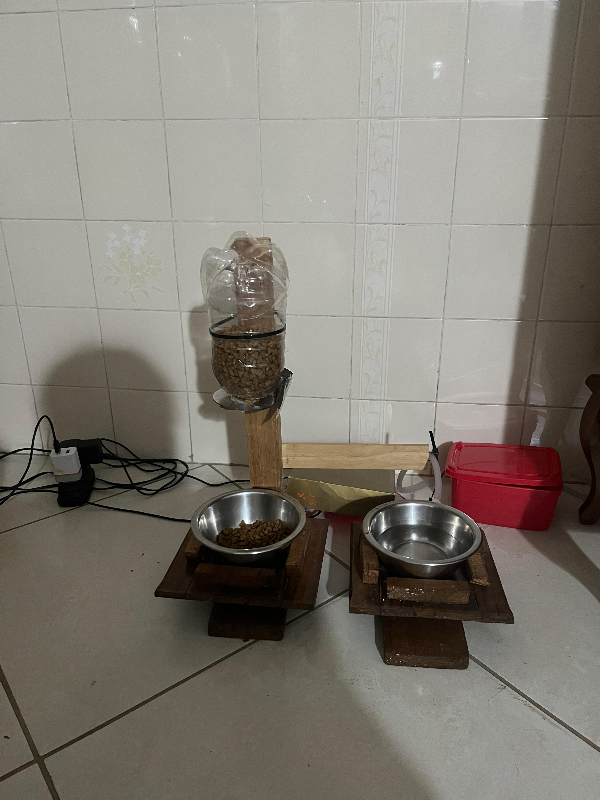
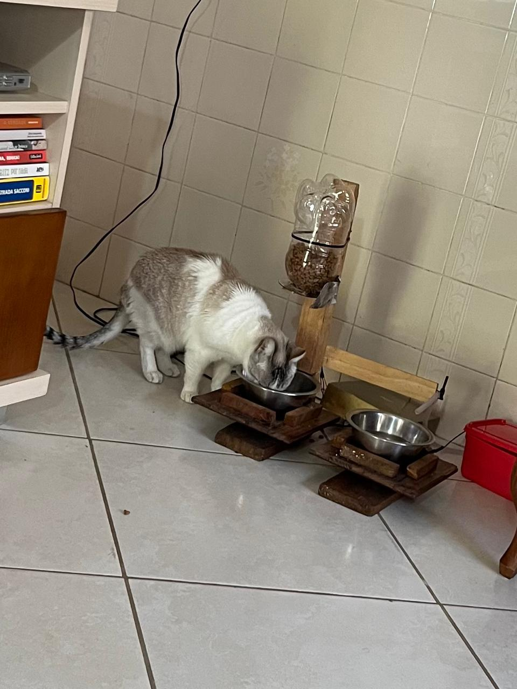

# Sistema Embarcado para Alimentação e Hidratação de Pets

Protótipo de um sistema embarcado para alimentação e hidratação automática de pets, desenvolvido com ESP32. O sistema monitora o peso das tigelas, repõe água automaticamente e libera ração nos horários programados.

A estrutura foi construída artesanalmente com madeira e materiais acessíveis ou reaproveitados, incluindo uma garrafa PET utilizada como reservatório de ração. Não foram utilizadas impressão 3D ou peças mecânicas fabricadas sob medida.

O objetivo desta versão foi desenvolver e validar uma solução funcional e de baixo custo, integrando sensores, atuadores, armazenamento local e comunicação com a nuvem.

## Protótipo

  
  

O protótipo foi testado em condições reais de uso, permitindo avaliar tanto o funcionamento do sistema eletrônico quanto a interação do animal com o equipamento.

## Funcionalidades

- Reposição automática de água conforme o peso da tigela.
- Liberação programada de ração com controle de quantidade.
- Detecção da retirada das tigelas e proteção contra transbordamento.
- Registro dos abastecimentos no ThingSpeak via Wi-Fi.
- Armazenamento local no LittleFS quando não há conexão com a internet.
- Relógio RTC para manter os horários mesmo após reinicializações ou quedas de energia.

## Como funciona

O ESP32 recebe as leituras de duas células de carga, uma para cada tigela.

Quando a quantidade de água fica abaixo do limite configurado, uma bomba é acionada até que o peso desejado seja atingido.

Nos horários definidos pelo RTC, um servo motor controla a liberação da ração. O sistema utiliza o peso medido pela célula de carga para liberar apenas a quantidade necessária.

Cada abastecimento pode ser registrado no ThingSpeak. Caso não haja conexão com a internet, o evento é armazenado localmente em formato CSV no LittleFS para envio posterior.

## Componentes

| Componente | Quantidade |
| :--- | :---: |
| ESP32 | 1 |
| Módulo HX711 | 2 |
| Célula de carga | 2 |
| Servo motor | 1 |
| Módulo relé de 1 canal | 1 |
| Bomba de água 5 V | 1 |
| Módulo RTC DS3231 | 1 |
| Fonte externa 5 V | 1 |

Além dos componentes eletrônicos, foram utilizados madeira, recipientes metálicos, uma garrafa PET e outros materiais simples na construção da estrutura.

## Esquemático

  

## Ligações principais

| Função | Pinos do ESP32 |
| :--- | :--- |
| Servo motor | GPIO 27 |
| HX711 da ração | DT 32 e SCK 33 |
| Relé da bomba | GPIO 26 |
| HX711 da água | DT 25 e SCK 14 |
| RTC DS3231 | SDA 21 e SCL 22 |

> O servo, o relé e a bomba utilizam alimentação externa de 5 V. O terra (GND) da fonte e o do ESP32 devem estar conectados em comum.

## Firmware

O firmware foi desenvolvido em Arduino/C++ para ESP32 e está disponível em [`firmware/Sistema_Inteligente_Pet.ino`](firmware/Sistema_Inteligente_Pet.ino).

Principais bibliotecas utilizadas: HX711, ESP32Servo, RTClib, Wire, WiFi, HTTPClient e LittleFS.

## Possíveis melhorias

O projeto atual foi desenvolvido como um protótipo funcional. Algumas melhorias possíveis para versões futuras incluem:

- Desenvolvimento de uma PCB dedicada.
- Estrutura mecânica mais compacta e resistente.
- Gabinete para proteção da eletrônica.
- Interface web ou aplicativo para configuração dos horários e quantidades.
- Atualização remota do firmware (OTA).
