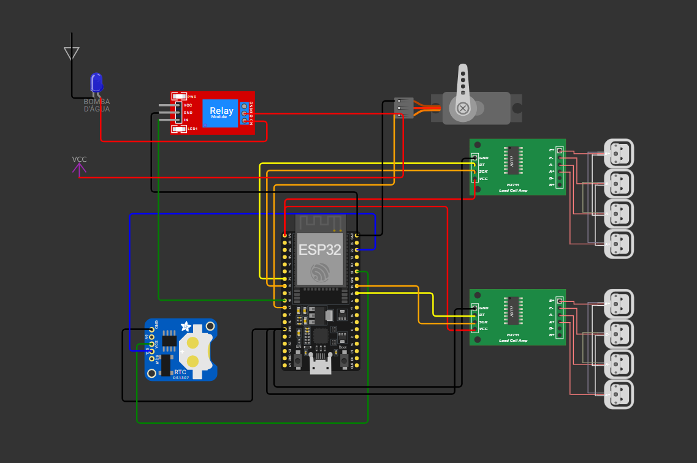

# 💻⚙️ Sistema Automático de Bebedouro e Comedouro para Pets

Projeto de uma estação autônoma de alimentação e hidratação para pets utilizando o microcontrolador ESP32. O sistema monitora continuamente o peso das tigelas usando células de carga e controla automaticamente:

* o enchimento da água
* a liberação de ração
* os horários de alimentação

Tudo ocorre de forma automática e segura, garantindo que o animal tenha sempre água e alimento disponíveis.

---

## ⚙️ Funcionamento do Sistema

### 💧 Bebedouro
* Monitora continuamente o peso da tigela.
* Ativa automaticamente a bomba quando o nível de água está baixo.
* Desliga quando o peso programado é atingido.
* Utiliza um tempo de estabilização para evitar leituras falsas.

### 🍖 Comedouro
* Libera ração utilizando um servo motor.
* Controle proporcional para atingir o peso programado da porção.
* Verifica se ainda existe ração antes de servir novamente.

### 🕒 RTC
* Mantém os horários de alimentação.
* Permite alimentar o pet em horários programados.
* Continua funcionando mesmo sem energia temporariamente.

---

## 📷 Esquemático do Sistema

  

---

## 🛠️ Componentes Utilizados

| Componente | Quantidade |
| :--- | :---: |
| ESP32 | 1 |
| Módulo HX711 | 2 |
| Células de carga | 2 |
| Servo motor | 1 |
| Módulo Relé (1 canal) | 1 |
| Bomba de água DC | 1 |
| Módulo RTC DS3231 | 1 |
| Fonte 5V externa | 1 |

---

## 🔌 Ligações do Circuito

### 🍖 Comedouro (Servo + Balança da Ração)

**Servo Motor**
| Fio do Servo | Conexão |
| :--- | :--- |
| Sinal (Laranja) | GPIO 27 |
| VCC (Vermelho) | 5V |
| GND (Marrom/Preto) | GND |

**Balança da Ração (HX711)**
| Pino HX711 | ESP32 |
| :--- | :--- |
| VCC | 3V3 |
| GND | GND |
| DT | GPIO 32 |
| SCK | GPIO 33 |

**Célula de Carga da Ração**
| Fio | HX711 |
| :--- | :--- |
| Vermelho | E+ |
| Preto | E- |
| Branco | A- |
| Verde | A+ |

### 💧 Bebedouro (Bomba + Relé + Balança da Água)

**Relé (Controle)**
| Pino Relé | ESP32 |
| :--- | :--- |
| VCC | 5V |
| GND | GND |
| IN | GPIO 26 |

**Relé (Potência da Bomba)**
| Conexão | Ligação |
| :--- | :--- |
| COM | Positivo (+) da fonte 5V |
| NO | Positivo (+) da bomba |
| Negativo da bomba | GND da fonte |

**Balança da Água (HX711)**
| Pino HX711 | ESP32 |
| :--- | :--- |
| VCC | 3V3 |
| GND | GND |
| DT | GPIO 18 |
| SCK | GPIO 19 |

### 🕒 Módulo RTC DS3231

| Pino RTC | ESP32 |
| :--- | :--- |
| SDA | GPIO 21 |
| SCL | GPIO 22 |
| VCC | 3V3 |
| GND | GND |

---

## 💻 Código

O firmware foi desenvolvido em Arduino/C++ para ESP32. Principais bibliotecas utilizadas:
* `HX711`
* `ESP32Servo`
* `RTClib`
* `Wire`
